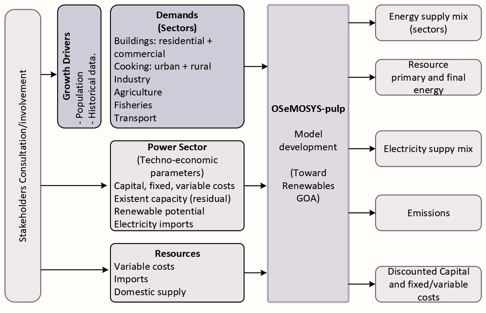

# The State of Goa energy system model

*Figure 1. State of Goa-model development methodology*

This repository presents an open-source energy model explicitly developed for the State of Goa (India). The energy model consists of several sectors, such as building (residential + commercial), cooking, industry, agriculture, fisheries, and transport. This energy system model was developed to be used with OSeMOSYS-pulp [^1].

## Input data
The input data is a **.xlsx* file located in:
```
./model/Input_Data/
```
The input data contains all the parameters necessary to run the optimization. The documentation regarding the parameters is similar to that found in the original version  [OSeMOSYS-GNU](https://osemosys.readthedocs.io/en/latest/) [^2].

## Model file
The model file represents an enhanced version of OSeMOSYS pulp. Notable improvements have been implemented to accelerate optimization in terms of matrix generation time and post-processing. This updated version now stands on par with the short version of OSeMOSYS-GNU, showcasing the continuous evolution and refinement of the model. The model file can be found at:
```
./model/OSeMOSYS.py/
```
Other dependencies and functions are located in:
```
./model/utils/
```

## Run the model
Creating a new environment and installing libraries such as pulp is advisable.
```
conda create --name pulp python=3.8
```
Activate the new environment to use it
```
conda activate pulp
```
Run the following code, and to use other solvers, type instead of, Cplex, gurobi, or CBC. The result file is a **.csv* file saved in the path *./Output_Data/GOA_COMPLETE_updated_results.csv*
```
python OSeMOSYS.py -i GOA_COMPLETE_updated.xlsx -s cplex -o csv
```

## Visualize results
In this version of the model, a Python notebook is provided to visualize the results. The notebook is located in the following path:
```
./scripts/visualizarion_csv_Goa.ipynb
```
[^1]: D. Dreier, M. Howells, Osemosys-Pulp: A Stochastic Modeling Framework for long-term Energy Systems Modeling, Energies. 12 (2019) 1382. doi:10.3390/en12071382. 
[^2]: M. Howells, H. Rogner, N. Strachan, C. Heaps, H. Huntington, S. Kypreos, et al., OSeMOSYS: The Open Source Energy Modeling System, Energy Policy. 39 (2011) 5850–5870. doi:10.1016/j.enpol.2011.06.033. 

Citing this repo: [](https://zenodo.org/doi/10.5281/zenodo.11093433)
